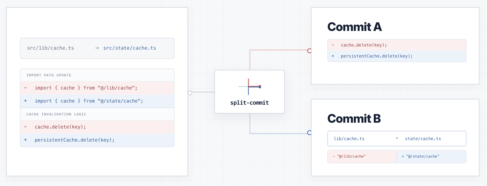

# split-commit

`split-commit` separates a mixed JavaScript/TypeScript refactor into two commits:

- **A**: code changes that may change behavior, plus anything uncertain
- **B**: structural changes the tool can verify with high confidence (**file moves, file name changes, import-path updates**)

If something breaks later, the Git history is easier to inspect because mechanical cleanup is isolated from changes that could have affected behavior.

**Example:** Suppose you move `src/lib/cache.ts` to `src/state/cache.ts`, update every import, and change the cache invalidation logic. `split-commit` produces:

```text
commit A  change cache invalidation logic
commit B  move cache.ts and update its import paths
```



## Installation

Requires Node.js 20+.

```bash
npm install -g @leesj-dev/split-commit
```

## Quick start

Run inside a repository with at least one commit. `split-commit` compares the current working tree with `HEAD`.

```bash
# See how changes are classified.
split-commit report            # summary
split-commit report --verbose  # with evidence

# Preview the A → B plan without committing.
split-commit apply --dry-run

# Create A and B commits.
split-commit apply

# Optionally provide custom commit messages.
split-commit apply "Implement cache invalidation" "Move cache module into state"
```

If A or B is empty, that commit is skipped. Default messages are `Apply behavioral changes` and `Apply mechanical structural refactor`.

## Commands

| Command            | Description                                     |
| ------------------ | ----------------------------------------------- |
| `report`           | Show A/B/ambiguous classifications              |
| `report --verbose` | Include the evidence behind each classification |
| `report --json`    | Print the report as JSON                        |
| `split --dry-run`  | Display the split plan without writing anything |
| `split`            | Write A/B patch files and verification metadata |
| `stage-a`          | Stage only A (does not commit)                  |
| `stage-b`          | Stage only B, after A has been committed        |
| `apply`            | Create A and B commits in order                 |

All commands accept `--cwd <path>` to target another repository.  
`--dry-run` works with `split`, `stage-a`, `stage-b`, and `apply`.

## What goes into A and B

**A** is the safe default. It contains any change the tool cannot confidently prove to be purely structural: logic changes, control flow, API shape, new or deleted files without a proven move partner, non-JS/TS files, and anything the classifier does not understand well enough.

**B** is narrow by design. Currently it covers:

- moving or renaming a JS/TS file without changing its code or comments
- updating `import`/`export` paths to follow a verified file move (including barrel files like `index.ts`)

A changed path string alone is not enough. The tool resolves both old and new imports and confirms they point to the same module, or to a file whose move was independently verified.

A single file can contain both kinds of changes. For example, if `App.ts` changes an import path and also changes component logic, the logic goes to A and the verified import edit goes to B.

> Putting a real behavior change in B would make the split misleading. Putting a harmless refactor in A is less convenient, but does not weaken the safety of B.

---

## Details

### Safety rules

- The Git index must be clean (no staged changes) before any staging command.
- Unstaged and untracked files are analyzed normally.
- If a Git hook modifies commit A, or the working tree changes after A is committed, automatic processing stops before B.

### Manual workflow

Use `stage-a` and `stage-b` when you want to inspect and commit each part yourself:

```bash
split-commit stage-a
git diff --cached
git commit -m "behavioral changes"

split-commit stage-b
git diff --cached
git commit -m "mechanical structural refactor"
```

`stage-b` must be run after A has been committed. If A candidates still remain, it exits without staging.

### Git alias

```bash
git config --global alias.split-commit '!split-commit apply'

# Then:
git split-commit
git split-commit "Custom A message" "Custom B message"

# Remove:
git config --global --unset alias.split-commit
npm uninstall -g @leesj-dev/split-commit
```

### Patch files

`split-commit split` writes:

```text
.split-commit/
  commit-a.patch   # HEAD → A-only version
  commit-b.patch   # A-only version → A+B (assumes A already applied)
  manifest.json    # hashes, file counts, tree IDs for verification
  report.json      # classification results
```

Use `--output-dir <path>` to change the output location.

### Reading a classification

Verbose output may include entries like:

```text
import-path-update      src/App.ts:4
  Reason: Both specifiers resolve to the same module identity or a proven file move
  - old "@/common/lib/DataCacheContext" -> src/common/lib/DataCacheContext.tsx
  - new "@/common/state/DataCacheContext" -> src/common/state/DataCacheContext.tsx
```

The import text changed, but the resolver confirmed the old and new paths refer to the same module before and after a verified move, so this edit qualifies for B.

### How B is verified

For a file move to qualify for B:

1. The JS/TS syntax and comments still match after accounting for import/export paths.
2. One old file matches exactly one new file, with no ambiguous duplicate.
3. The file does not use path-sensitive constructs the checker cannot handle safely (dynamic imports, `require()`, `import.meta`, `__dirname`, `__filename`, side-effect-only imports, reflection, string-based module references, bundler-specific behavior).
4. Static imports and exports resolve successfully before and after the refactor.
5. Each resolved dependency is the same file, or another file whose move was also verified.

The tool uses the TypeScript Compiler API to parse source files and resolve modules against both `HEAD` and the current working tree.

### Current limits

These changes fall back to A:

- Renaming a symbol and proving every reference still points to the same declaration
- Moving a declaration from one file to another
- Standalone formatting or import sorting
- Arbitrary JS/TS changes that would require proving two programs behave identically

## Compared with other tools

| Tool           | Main job                                                                         |
| -------------- | -------------------------------------------------------------------------------- |
| difftastic     | Syntax-aware diffs                                                               |
| `jj split`     | Interactive commit splitting                                                     |
| `git add -p`   | Manual hunk-by-hunk staging                                                      |
| git-absorb     | Assign changes to earlier commits                                                |
| `split-commit` | Automatically separate verified structural refactors from behavior-changing code |

## Project structure

```text
src/
  git/          Git working-tree collection and move detection
  ts/           TypeScript/JavaScript parsing and module resolution
  classifier/   A/B classification
  planner/      patch generation, staging, and commit planning
  cli/          command-line interface
```
